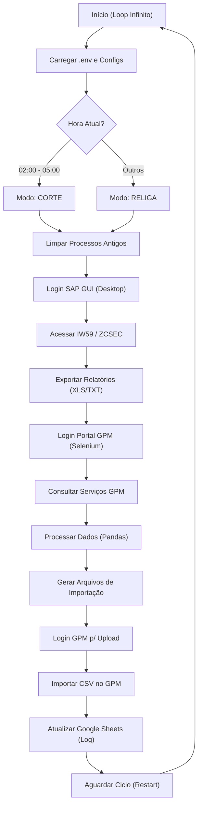

# Robô de Importação e Exportação SAP/GPM (RPA)

Este projeto consiste em um robô RPA (Robotic Process Automation) desenvolvido em Python para automatizar o fluxo de dados entre o sistema SAP (ERP) e o portal GPM (Gestão de Serviços). O robô gerencia processos de "Corte" e "Religação" de energia, baixando dados do SAP e atualizando o sistema de gestão externo.

## Resumo Executivo

**Problema de Negócio:**
A sincronização manual entre o SAP (onde as ordens de serviço de corte/religa são geradas) e o GPM (sistema de gestão de campo) é repetitiva, sujeita a erros e consome muitas horas humanas. A falta de atualização rápida pode gerar inconsistências entre o que a equipe de campo deve fazer e o que consta no sistema da concessionária.

**O que o robô faz:**
1.  **Monitora horários**: Identifica se deve processar "Cortes" (madrugada) ou "Religas" (dia/noite).
2.  **Acessa o SAP GUI**: Loga automaticamente no cliente Desktop do SAP, navega transações (IW59, ZCSEC, ZSEC) e exporta relatórios.
3.  **Crawler Web (GPM)**: Acessa o portal GPM via navegador, consulta serviços e realiza upload/importação dos dados tratados.
4.  **Processamento de Dados**: Cruza informações usando Pandas e Excel para formatar os arquivos de importação.
5.  **Resiliência**: Possui mecanismos de auto-restart e limpeza de processos travados.

**Sistemas Acessados:**
-   **SAP ERP (Desktop Client)** via automação de GUI (Scripting API/COM).
-   **Portal GPM** (Web) via Selenium.
-   **Google Drive/Sheets** (API) para logs e configurações.

---

## Fluxo Lógico



---

## Stack Tecnológica

O projeto utiliza **Python 3.x** e opera fortemente sobre o ecossistema Windows.

### Linguagens e Core
-   **Python 3.10+** (Inferido)
-   **Pandas 1.5.3**: Manipulação de dados (ETL).

### Automação Desktop (RPA)
-   **pywin32 (win32com)**: Comunicação com a API de Scripting do SAP GUI.
-   **PyAutoGUI 0.9.54**: Interação visual (cliques, atalhos) para janelas popup e diálogos de salvar arquivo.
-   **PyGetWindow / MouseInfo**: Auxiliares de controle de janela.

### Automação Web
-   **Selenium 4.17.2**: Navegação e interação com o portal GPM.
-   **Undetected Chromedriver**: Bypass de detecções de bot simples.

### Integrações e Utilitários
-   **Google Client Library (gspread, PyDrive2)**: Integração com Google Sheets/Drive.
-   **python-dotenv**: Gestão de variáveis de ambiente.
-   **Multiprocessing**: Controle de processos para evitar vazamento de memória em longas execuções.

---

## Pré-requisitos e Instalação

### Dependências de Sistema (Obrigatório Windows)
1.  **Sistemas Operacionais**: Windows 10/11 ou Windows Server (com Interface Gráfica).
2.  **SAP Logon (GUI)**: O cliente SAP deve estar instalado e configurado.
    *   A opção *SAP GUI Scripting* deve estar habilitada no servidor e no cliente.
3.  **Google Chrome**: Navegador compatível com o Selenium.
4.  **Microsoft Excel**: Necessário para abrir e salvar relatórios exportados pelo SAP.

### Variáveis de Ambiente (.env)
Crie um arquivo `.env` na raiz com as chaves (sem valores reais):

```ini
# SAP Credentials
SAP_USER=usuario_sap
SAP_PASS=senha_sap
SAP_SID=SID_DO_SISTEMA
SAP_MANDANT=CLIENT_ID

# GPM Credentials
GPM_LOGIN=usuario_gpm
GPM_PASS=senha_gpm

# Google API
GDRIVE_CHROME_ID=id_pasta_drive
ZIP_CHROME_NAME=nome_arquivo_zip

# Paths & Configs
TIME_RESTART=900
TIME_RESET=1800
CHROME_BINARIES_PATH=\caminho\chromium
```

### Instalação

1.  Clone o repositório.
2.  Crie um ambiente virtual:
    ```bash
    python -m venv venv
    .\venv\Scripts\activate
    ```
3.  Instale as dependências:
    ```bash
    pip install -r requirements.txt
    ```
4.  Configure o arquivo `.env`.
5.  Execute o robô:
    ```bash
    python app.py
    ```

---

## Estrutura de Arquivos

-   `app.py`: Ponto de entrada. Gerencia o ciclo de vida (início, fim, reinício) e orquestra os módulos.
-   `sap_handler.py`: Módulo **crítico**. Contém toda a lógica de manipulação do SAP via COM/Scripting e PyAutoGUI.
-   `web_crawler.py`: Classe responsável por todas as interações web (Selenium) com o portal GPM.
-   `data_handle.py`: Lógica de negócios. Tratamento de planilhas, cruzamento de dados e geração de CSVs.
-   `image_finder.py`: Wrapper do PyAutoGUI para localizar imagens na tela (usado para lidar com popups do SAP/Excel).
-   `directories.py`, `files.py`: Auxiliares para gestão de pastas temporárias e arquivos.
-   `gsheets.py`, `gdrive.py`: Wrappers para APIs do Google.

---

## Análise de Viabilidade: GitHub Actions (CI/CD)

**Veredito:** 🔴 **INVIÁVEL** (no modelo padrão/básico)

A execução deste robô diretamente em runners hospedados pelo GitHub (Ubuntu/Windows Latest) **não funcionará** sem alterações profundas de infraestrutura ou código.

### Bloqueadores Críticos

1.  **Dependência do SAP GUI (Desktop App)**:
    *   O código usa `win32com.client.GetObject('SAPGUI')`. Isso exige que o software *SAP Logon* esteja instalado e rodando uma sessão interativa no Windows.
    *   GitHub Actions runners são ambientes efêmeros e "limpos". Instalar e configurar o SAP GUI a cada build é extremamente complexo, lento e pode violar licenças.

2.  **Interação Visual (PyAutoGUI / ImageFinder)**:
    *   O módulo `image_finder.py` busca imagens na tela (`pyautogui.locateCenterOnScreen`).
    *   Funções como `excel_salvar_como` e `seg_sap_gui` dependem de uma resolução de tela específica e de um monitor ativo. Runners padrão rodam em modo "headless" ou com resoluções básicas que quebram o reconhecimento de imagem.

3.  **Comandos de Sistema (Windows Only)**:
    *   O uso de `os.system('wmic process ...')` e `taskkill` prende o código ao Windows.

4.  **Acesso à Rede (VPN)**:
    *   Para conectar ao servidor SAP, o robô provavelmente precisa estar dentro da rede da empresa (Intranet/VPN). O GitHub Actions roda na nuvem pública (Azure/AWS) e não terá acesso ao IP do SAP sem uma VPN (e.g., OpenVPN, Tailscale) configurada no pipeline.

### Sugestão de Migração e Caminhos Possíveis

**Opção A: Self-Hosted Runner (Recomendado para manter código atual)**
*   Configurar uma **Máquina Virtual (VM)** Windows permanente na infraestrutura da empresa.
*   Instalar SAP GUI, Python, Chrome e Excel nessa VM.
*   Instalar o agente do GitHub Actions nessa VM (`Self-hosted runner`).
*   O robô rodará dentro dessa VM, usando a sessão de usuário ativa.

**Opção B: Refatoração para Nuvem (Ideal a longo prazo)**
*   **SAP**: Substituir a automação de GUI (`sap_handler.py`) por chamadas de API (OData/SOAP) ou usar a biblioteca `pyrfc` (conexão direta RFC) para extrair dados sem abrir o software SAP.
*   **Excel**: Remover dependência visual do Excel. Usar apenas `pandas` para ler/escrever arquivos.
*   **Selenium**: Configurar modo `--headless` no Chrome.
